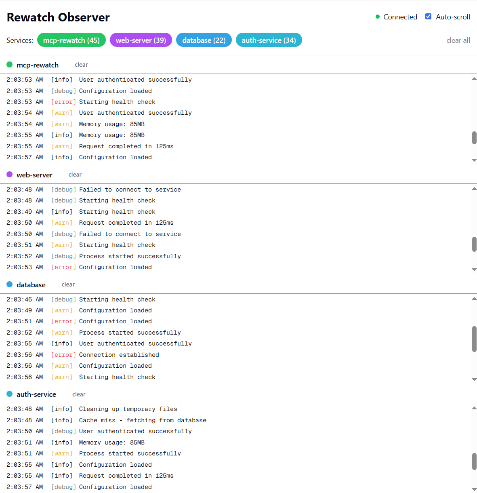

# Rewatch Observer

A real-time observability platform for monitoring log streams from multiple services. Built with Next.js 15, TypeScript, and Server-Sent Events for live log streaming.



## Features

- **Real-time Log Streaming**: Live updates via Server-Sent Events (SSE)
- **Swimlane UI**: Separate horizontal lanes for each service
- **Service Filtering**: Toggle individual services on/off
- **Color-Coded Services**: Automatic color assignment for visual distinction
- **Stdout Multiplexing**: Colored terminal output with intelligent grouping
- **In-Memory Storage**: Efficient ring buffer implementation (10,000 logs max)
- **Clear Functionality**: Clear logs per service or all at once
- **Auto-Scroll**: Optional automatic scrolling for real-time monitoring

## Quick Start

```bash
# Install dependencies
pnpm install

# Run the development server
pnpm dev

# In another terminal, run the test client
node test-client.js
```

Open [http://localhost:4000](http://localhost:4000) to view the web interface.

## API Documentation

### POST /api/logs

Submit log events to the observer.

**Request Body Schema:**

```typescript
{
  source: string,      // Required: Service name (e.g., "web-server", "database")
  level: string,       // Required: Log level ("info" | "error" | "warn" | "debug")
  message: string,     // Required: Log message content
  metadata?: object    // Optional: Additional context as key-value pairs
}
```

**Example Request:**

```bash
curl -X POST http://localhost:4000/api/logs \
  -H "Content-Type: application/json" \
  -d '{
    "source": "api-server",
    "level": "info",
    "message": "Request processed successfully",
    "metadata": {
      "requestId": "123",
      "duration": 45
    }
  }'
```

**Response:**

```json
{
  "id": "log-1",
  "timestamp": "2024-01-03T10:15:30.123Z",
  "source": "api-server",
  "level": "info",
  "message": "Request processed successfully",
  "metadata": {
    "requestId": "123",
    "duration": 45
  }
}
```

### GET /api/logs

Retrieve stored logs.

**Query Parameters:**
- `count` (optional): Number of most recent logs to retrieve

**Examples:**

```bash
# Get all logs
curl http://localhost:4000/api/logs

# Get last 100 logs
curl http://localhost:4000/api/logs?count=100
```

### GET /api/stream

Server-Sent Events endpoint for real-time log streaming.

**Usage:**

```javascript
const eventSource = new EventSource('/api/stream')

eventSource.onmessage = (event) => {
  const data = JSON.parse(event.data)
  
  if (data.type === 'connected') {
    console.log('Connected to log stream')
  } else if (data.type === 'log') {
    console.log('New log:', data.data)
  }
}
```

## Terminal Output

The observer multiplexes all received logs to stdout with:
- Color-coded service names
- Log level indicators
- 200ms debounce for grouping related logs
- Structured format: `[timestamp] [service] [level] message`

Example output:
```
12:51:16 AM [database] [info] Connection established
12:51:17 AM [web-server] [error] Cache miss - fetching from database
12:51:19 AM [mcp-rewatch] [debug] Cache miss - fetching from database
```

## Architecture

- **Next.js 15**: Server and UI in a single application
- **TypeScript**: Full type safety
- **Tailwind CSS**: Utility-first styling
- **Server-Sent Events**: Efficient real-time updates
- **In-Memory Storage**: Fast access with automatic cleanup
- **Ring Buffer**: Memory-efficient log storage (10,000 log limit)

## Development

```bash
# Install dependencies
pnpm install

# Run development server
pnpm dev

# Build for production
pnpm build

# Start production server
pnpm start

# Run linting
pnpm lint
```

## Configuration

The platform includes several configuration options:

- **Max Logs**: Default 10,000 logs kept in memory (configurable in `src/lib/log-store.ts`)
- **Debounce Time**: 200ms for stdout multiplexing (configurable in `src/lib/stdout-multiplexer.ts`)
- **Service Colors**: 8 predefined colors that cycle for new services

## Integration Examples

### Node.js Integration

```javascript
async function sendLog(message, level = 'info') {
  await fetch('http://localhost:4000/api/logs', {
    method: 'POST',
    headers: { 'Content-Type': 'application/json' },
    body: JSON.stringify({
      source: 'my-service',
      level,
      message
    })
  })
}

// Usage
sendLog('Service started')
sendLog('Failed to connect', 'error')
```

### Python Integration

```python
import requests
import json

def send_log(message, level='info', metadata=None):
    response = requests.post(
        'http://localhost:4000/api/logs',
        headers={'Content-Type': 'application/json'},
        data=json.dumps({
            'source': 'python-service',
            'level': level,
            'message': message,
            'metadata': metadata or {}
        })
    )
    return response.json()

# Usage
send_log('Processing complete')
send_log('Database error', 'error', {'code': 'DB_CONN_FAILED'})
```

## UI Features

### Swimlane View
- Each service gets its own horizontal lane
- Automatic height distribution based on enabled services
- Independent scrolling per lane
- Service name and log count in toggle buttons

### Controls
- **Service Toggles**: Click service buttons to show/hide lanes
- **Clear All**: Remove all logs from browser (server retains logs)
- **Clear Service**: Clear logs for individual services
- **Auto-scroll**: Toggle automatic scrolling to latest logs
- **Connection Status**: Visual indicator for SSE connection

## License

Apache-2.0

## Author

Brennan Cheung